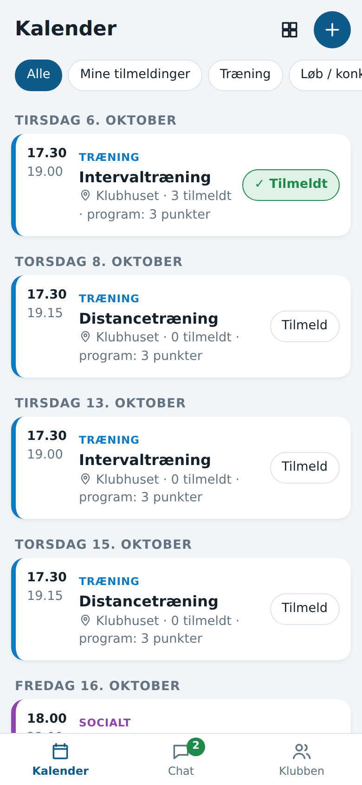
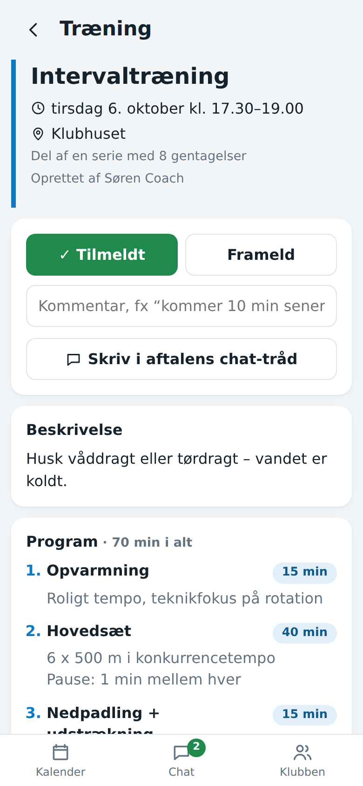
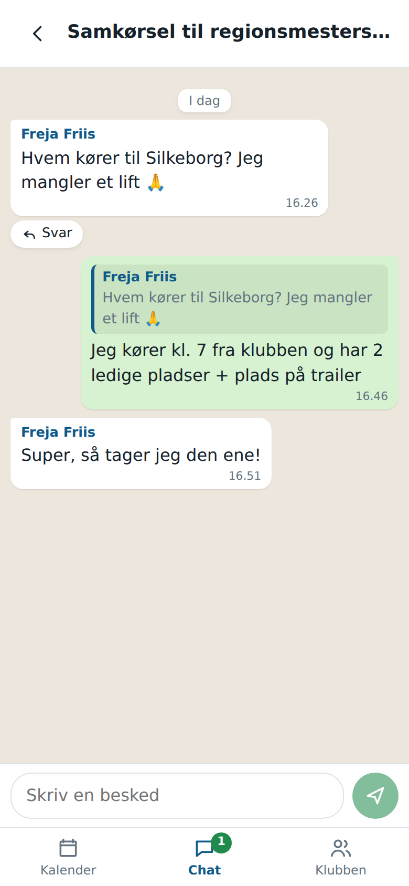

# Kajakklubben

En app til planlægning og kommunikation i kajakklubben – som erstatning for de lange WhatsApp-tråde.

| Kalender | Træningspas med program | Chat-tråd |
|---|---|---|
|  |  |  |

## Funktioner

**Kalender**
- Overblik over alle træninger, løb, sociale arrangementer og øvrige aftaler – som liste eller månedsvisning.
- Filtrér på type eller "Mine tilmeldinger".
- Hver træning har et **program** med punkter (fx opvarmning, hovedsæt, nedpadling), detaljer og varighed. Der er en skabelon at starte fra.
- **Tilmeld / frameld** direkte fra listen eller på aftalen, evt. med en kommentar ("kommer 10 min senere").
- Se hvem der er tilmeldt, frameldt og hvem der ikke har svaret.
- Max. antal deltagere (fx bådpladser) – tilmelding lukker, når der er fuldt.
- **Gentagelser**: opret fx tirsdagstræningen for de næste 10 uger på én gang. Ændringer af titel, program mv. kan rulles ud til resten af serien.
- Aftaler kan aflyses (bliver stående med "AFLYST"), kopieres eller slettes.

**Chat**
- Tråde om emner – fx samkørsel, udstyr, sommerturen – i WhatsApp-stil med bobler, svar på en bestemt besked og sletning af egne beskeder.
- Hver aftale i kalenderen har automatisk sin egen tråd, så snakken om en træning holdes samlet.
- Ulæste beskeder vises med tæller, og nye beskeder dukker op med det samme (live).

**Push-notifikationer**
- Besked på telefonen ved nye chat-beskeder, nye træninger/aftaler, og når en aftale man er tilmeldt bliver aflyst eller flyttet.
- Hver bruger vælger selv under *Klubben → Notifikationer*: chat-beskeder fra alle tråde, kun tråde man deltager i (standard – tråde man har startet eller skrevet i, og tråde for aftaler man er tilmeldt), eller slet ikke.
- Virker på Android og computer i Chrome, Edge og Firefox. På iPhone (iOS 16.4+) skal appen først lægges på hjemmeskærmen fra Safari.
- Man får ikke besked om den tråd, man allerede sidder og kigger på.

**Medlemmer og roller**
- **Administrator**: alt, inkl. at tildele roller. Den første bruger, der oprettes, bliver administrator.
- **Træner**: opretter og redigerer træninger og løb (og alle andre aftaler).
- **Medlem**: tilmelder sig, chatter og kan oprette sociale/øvrige aftaler og redigere sine egne.
- Nye medlemmer opretter sig selv med en **klubkode**, så fremmede ikke kan komme ind.

Appen er en web-app, der virker på mobil og computer. På telefonen kan den lægges på hjemmeskærmen ("Føj til hjemmeskærm"), så den åbner som en almindelig app.

## Kom i gang lokalt

Kræver [Node.js](https://nodejs.org) 22.13 eller nyere.

```sh
npm install
npm run seed     # valgfrit: demo-data (log ind som tina@example.com / kajak1234)
                 # npm run seed:reset sletter databasen og starter forfra (stop serveren først)
npm run dev      # server på :3000 og frontend med hot reload på http://localhost:5173
```

Demo-dataene indeholder kapholdets uge 40-program (fra `server/seed-data/kaphold.js`) lagt ind i den aktuelle uge, så man kan prøve tilmelding: fællestræningerne på de faste tidspunkter med træner, de øvrige pas i et af dagens vinduer, og en chat-tråd med træningstider og intensiteter. Brugere: `tina@` (admin), `torsten@` og `christen@` (trænere), `mads@`, `olga@`, `freja@`, `jonas@` (medlemmer) – alle `@example.com` med adgangskoden `kajak1234`.

Test: `npm test`

> **Windows:** Hvis PowerShell siger, at `npm.ps1` "is not digitally signed", så skriv `npm.cmd` i stedet for `npm` (fx `npm.cmd run dev`), eller brug Kommandoprompt (`cmd`).

## Drift

Trin-for-trin-guide til at sætte appen i drift hos Render med eget domæne: se [DEPLOY.md](DEPLOY.md).

```sh
npm install
npm run build
CLUB_INVITE_CODE=hemmelig-klubkode PORT=3000 npm start
```

Appen er én Node-proces med en SQLite-database (filen `data/kajakklub.db`), så den kan køre på en lille server eller en hosting-tjeneste med en vedvarende disk (fx Fly.io, Railway, Render eller en Raspberry Pi i klubhuset). Den skal køre bag HTTPS, da login-cookien kun sendes over en sikker forbindelse i produktion.

| Miljøvariabel | Betydning |
|---|---|
| `CLUB_INVITE_CODE` | Klubkoden alle skal bruge for at oprette sig – også den første bruger, der bliver administrator. Uden den kan alle oprette en bruger. |
| `PORT` | Port (standard `3000`). |
| `DATABASE_FILE` | Placering af databasen (standard `data/kajakklub.db`). Tag backup af denne fil. |
| `CLUB_TIMEZONE` | Tidszone til datoer i notifikationer (standard `Europe/Copenhagen`). |
| `VAPID_PUBLIC_KEY`, `VAPID_PRIVATE_KEY` | Nøgler til push-notifikationer. Valgfrit: uden dem genereres et sæt automatisk og gemmes i databasen. Lav dem med `npx web-push generate-vapid-keys`. |
| `VAPID_SUBJECT` | Kontakt-adresse til push-tjenesterne, fx `mailto:formand@kajakklub.dk`. |

## Teknik

- `server/` – Express-API med indbygget SQLite (`node:sqlite`), cookie-baseret login (scrypt-hashede adgangskoder), Server-Sent Events til live-opdateringer og Web Push (`server/notify.js`) til notifikationer.
- `client/` – React-app bygget med Vite, mobile-first, lys/mørk tilstand, PWA-manifest og service worker (`client/public/sw.js`), der viser notifikationerne.
- `server/test/` – API-tests (`node --test`).

## Idéer til næste skridt

- Mulighed for at slå lyden fra i enkelte tråde.
- Kalender-abonnement (iCal), så træningerne kan ses i telefonens egen kalender.
- Billeder i chatten.
- Hold/grupper (fx ungdom, motion, elite) med egne træninger og tråde.
- Glemt adgangskode via e-mail.
